# CivicResolve — Data Flow Sequence Diagrams

How **every bit of data** moves through the codebase: web (React), Android (Kotlin), Express API, Socket.IO, MongoDB, Cloudinary, Gmail, Google OAuth, Nominatim and ngrok.

> [!tip] Viewing this in Obsidian
> Mermaid is built into Obsidian — just open this note and switch to **Reading view** or **Live Preview**. Every diagram is self-contained, so you can also copy any single block into a scratch note.

**System map (orientation)**

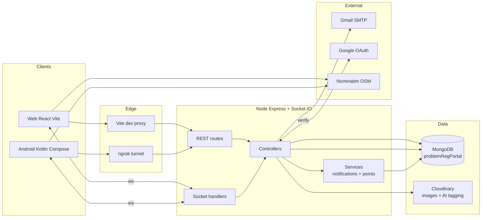

**Contents**

- [[#0 · The full complaint lifecycle (master diagram)]]
- [[#1 · Authentication — OTP, Google OAuth, session, password reset]]
- [[#2 · The location pipeline — GPS, Nominatim, home district, heartbeat]]
- [[#3 · Filing a complaint — duplicate check, geo-fence, AI categorization]]
- [[#4 · Admin triage & resolution — after photo, fan-out, email, points]]
- [[#5 · Real-time chat — Socket.IO rooms, recipient resolution, seen receipts]]
- [[#6 · Community verification — 3 nearby verifiers, atomic threshold flip]]
- [[#7 · Disputes — AI photo check, reopen vs confirm]]
- [[#8 · Notifications & gamification plumbing]]
- [[#9 · Read paths — public feed, map, analytics]]
- [[#Participant legend]]

---

## 0 · The full complaint lifecycle (master diagram)

The backbone of the whole system — one complaint's life from report to confirmed resolution. Each phase is zoomed into by diagrams 1–9.

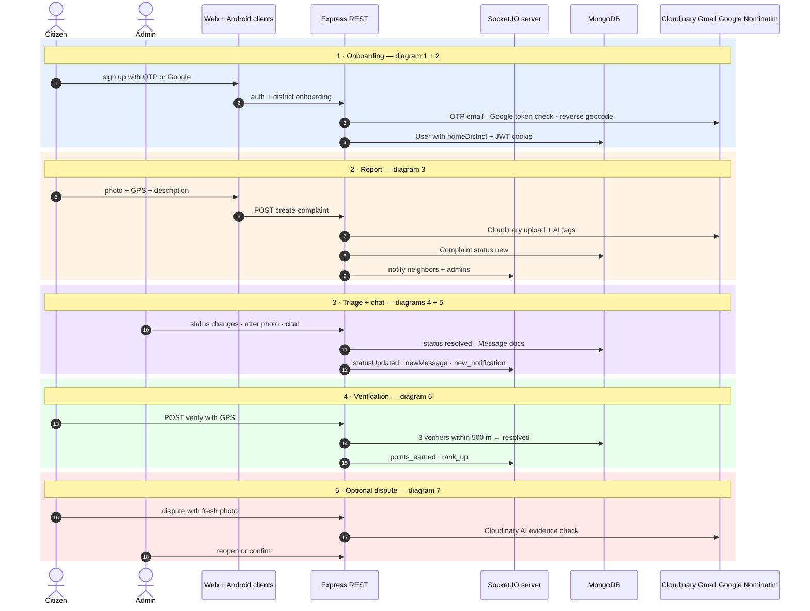

---

## 1 · Authentication — OTP, Google OAuth, session, password reset

**Code:** `backend/controllers/user.controller.js` · `backend/middleware/auth.middleware.js` · `frontend/src/pages/Signup.jsx` · `frontend/src/components/OnboardingDistrict.jsx`

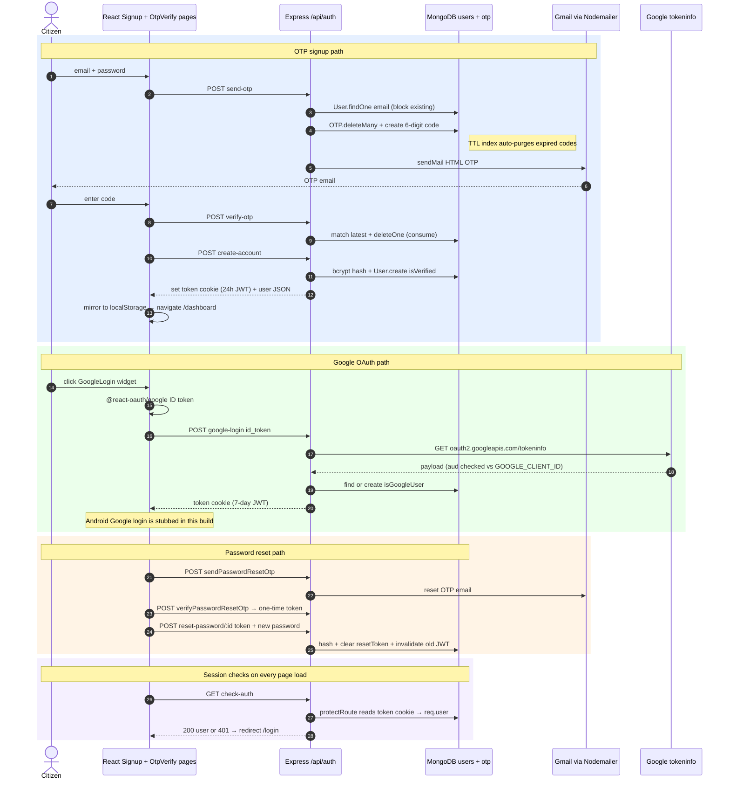

> [!note] Transport detail
> The JWT always lives in an http-only `token` cookie. Web keeps a **UI-only** mirror in localStorage; Android persists it via `EncryptedSharedPreferences` inside `CookieJarImpl` and re-injects the cookie on every Retrofit call.

---

## 2 · The location pipeline — GPS, Nominatim, home district, heartbeat

Location data feeds three features: the **geo-fence** for reporting, the **admin jurisdiction** routing, and the **1 km verification fan-out**.

**Code:** `frontend/src/components/OnboardingDistrict.jsx` · `frontend/src/pages/Explore.jsx` · `android/.../utils/LocationUtilsNew.kt` + `LocationUtils.kt` · `backend/controllers/user.controller.js` (updateHomeDistrict, updateUserLocation)

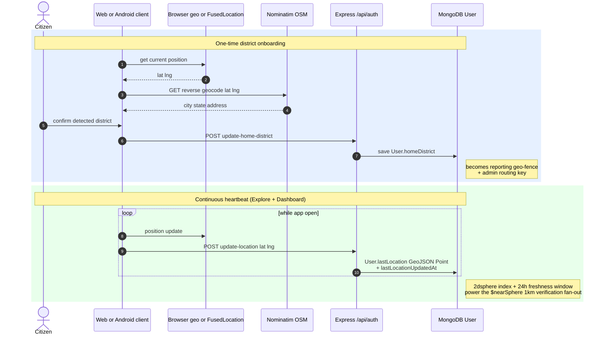

---

## 3 · Filing a complaint — duplicate check, geo-fence, AI categorization

**Code:** `frontend/src/components/dashboard/NewComplaint.jsx` · `backend/middleware/uploads.js` · `backend/controllers/complaint.controller.js` (createComplaint:127, getNearbyComplaints:1459, analyzeImage:49) · `backend/config/constants.js` · `backend/services/notificationService.js`

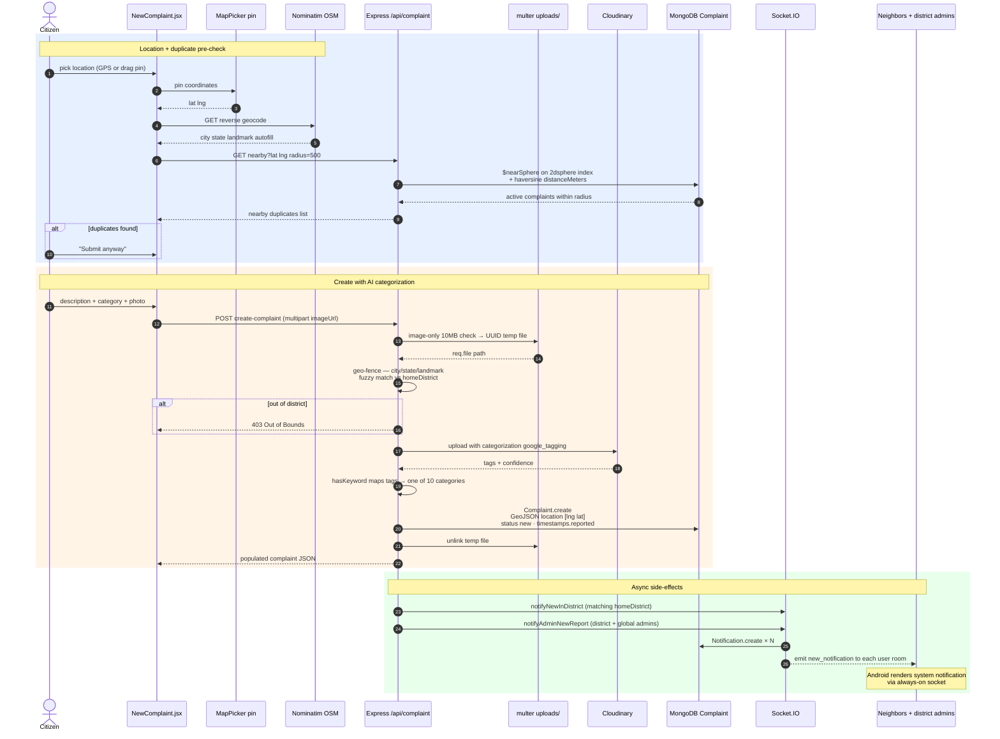

> [!note] Where the "AI" lives
> There is no external LLM. Categorization = **Cloudinary's google_tagging add-on**; tags are mapped to civic categories via the keyword lists in `backend/config/constants.js`. The same trick is reused for dispute evidence in diagram 7. A standalone `POST analyze-image` endpoint lets the client preview the detected category before submitting.

---

## 4 · Admin triage & resolution — after photo, fan-out, email, points

**Code:** `frontend/src/components/adminDashboard/*` · `backend/controllers/complaint.controller.js` (updateComplaint:787, updateComplaintStatus:496, updateAfterImageUrl:650) · `backend/services/pointsService.js` · `backend/config/email.js`

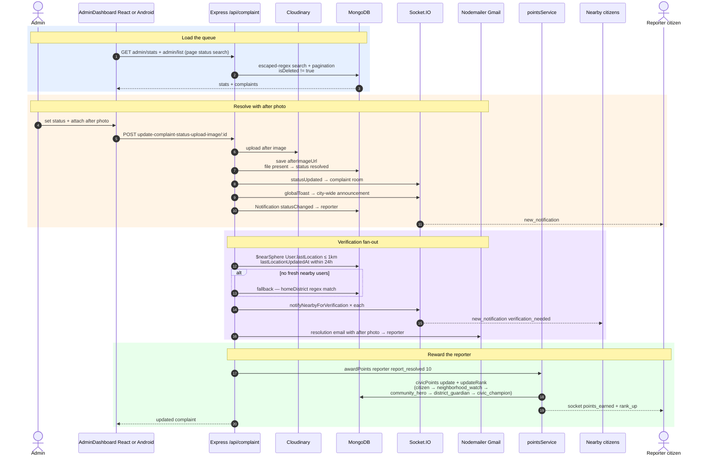

> [!warning] Status coercion rule
> Text-only `updateComplaintStatus` with status `resolved` but **no photo** is coerced to `pending_verification` — a photo is mandatory for a true resolve. `upload-after-image/:id` performs the same fan-out on its own.

---

## 5 · Real-time chat — Socket.IO rooms, recipient resolution, seen receipts

**Code:** `backend/server.js:62-244` · `backend/middleware/socket.auth.js` · `backend/routes/message.route.js` · `frontend/src/components/ChatBox.jsx` · `frontend/src/pages/ComplaintChat.jsx` · `android/.../ChatViewModel` + `ChatBox.kt`

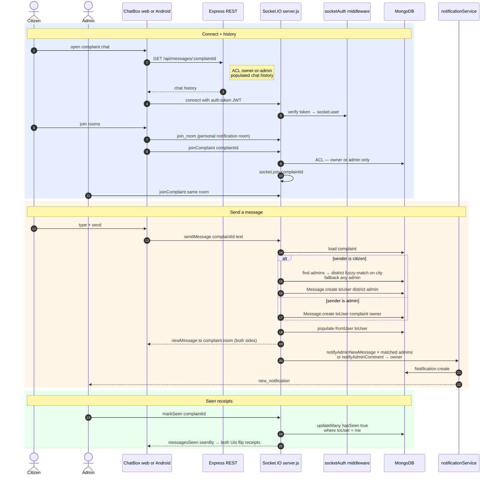

> [!note] Recipient resolution is server-side
> Clients never choose `toUser`. The server resolves admin→owner, or citizen→district-matched admin (`"all"` / empty homeDistrict = global admin, fuzzy substring + first-word core match), with a fallback to all admins so messages are never lost — `backend/server.js:100-214`.

---

## 6 · Community verification — 3 nearby verifiers, atomic threshold flip

**Code:** `backend/controllers/complaint.controller.js:1692` · `backend/services/pointsService.js` · `frontend/src/pages/ComplaintOverviewPage.jsx` · `android/.../ComplaintOverviewScreen`

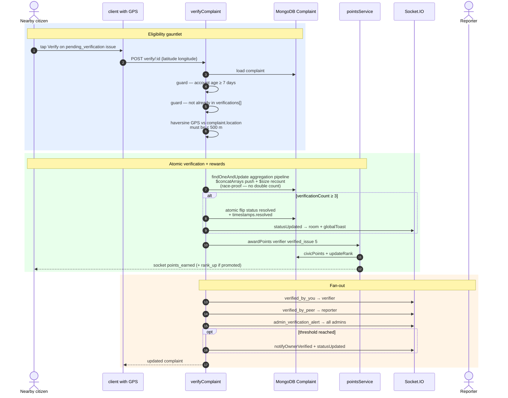

> [!tip] Gamification triggers elsewhere
> `supportComplaint` (:1518) awards the reporter **3 pts** on the *first-ever* upvote per user (`upvotersAwarded[]` anti-farming), and the 3-verification flip awards the reporter **10 pts** via `report_resolved`.

---

## 7 · Disputes — AI photo check, reopen vs confirm

**Code:** `backend/controllers/complaint.controller.js:1837` (disputeComplaint) and `:1941` (resolveDispute)

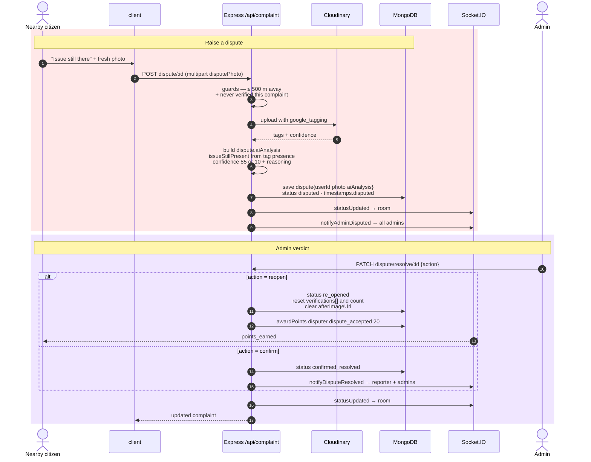

---

## 8 · Notifications & gamification plumbing

Every notify call follows the same two-step pattern: **DB write + socket emit**. No FCM — Android push is an always-on Socket.IO connection.

**Code:** `backend/services/notificationService.js` · `backend/services/pointsService.js` · `android/.../notification/NotificationSocketManager.kt` · `backend/routes/notification.route.js` (REST endpoints exist but no UI consumer)

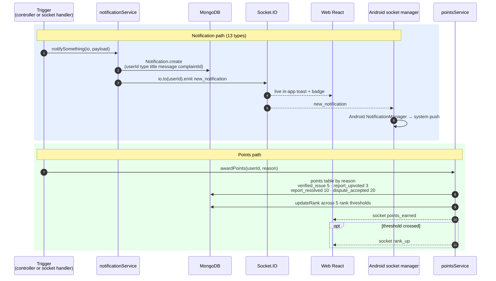

---

## 9 · Read paths — public feed, map, analytics

**Code:** `frontend/src/pages/LandingPage.jsx` + `Explore.jsx` + `MapView.jsx` · `frontend/src/components/explore/*` · `backend/controllers/analytics.controller.js` + complaint.controller.js (getPublicFeed:1605, getPublicStats:1651) · `android/.../ExploreScreen` + `MapViewScreen`

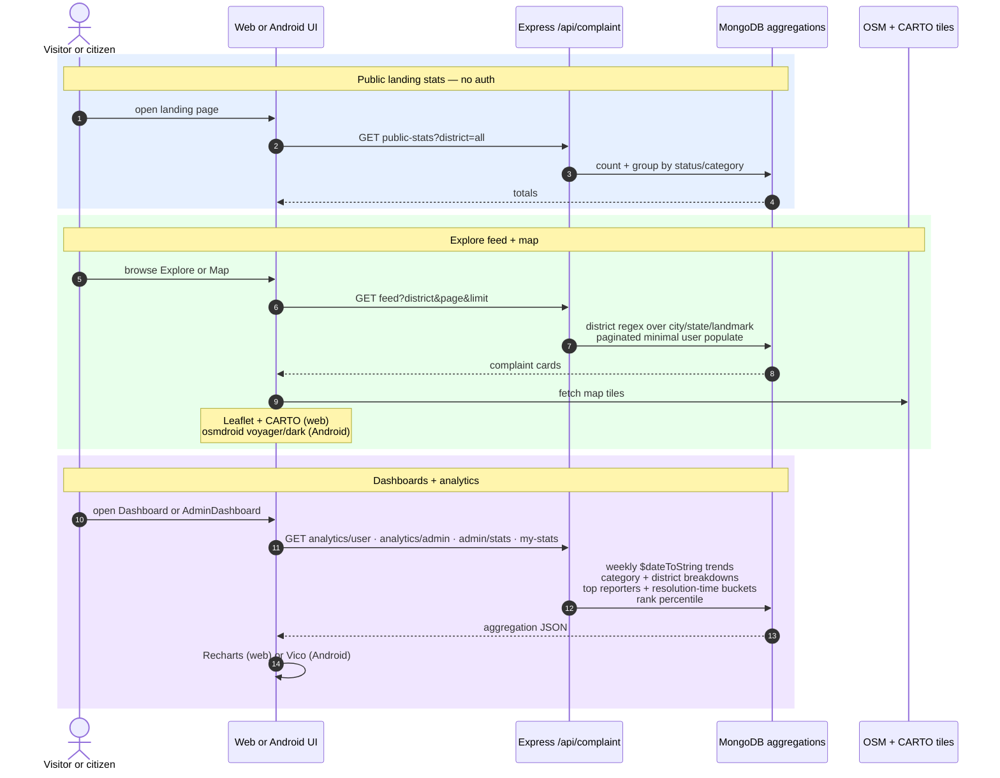

> [!warning] Dormant code worth knowing
> `backend/routes/analytics.route.js` is defined but **never mounted** (analytics live under the complaint router). The `/api/notifications` REST endpoints have no UI consumer — all notification delivery rides the socket. `frontend/public/themes/` are static design mocks.

---

## Participant legend

| Participant | Actual component | Key files |
|---|---|---|
| Web client | React 19 + Vite 7 SPA (citizen + admin) | `frontend/src/App.jsx`, `api/axios.js`, `utils/socket.js` |
| Android client | Kotlin + Jetpack Compose + Retrofit/Moshi | `android/.../di/AppContainer.kt`, `data/remote/ApiService.kt` |
| Express REST | Express 5, port 4000 | `backend/server.js`, `routes/*.route.js` |
| Socket.IO | Same Node process, room-based | `backend/server.js`, `middleware/socket.auth.js` |
| MongoDB | DB `problemRegPortal`, 5 collections | `backend/models/*.model.js` |
| Cloudinary | Image hosting + google_tagging "AI" | `backend/config/cloudinary.js`, `config/constants.js` |
| Gmail / Nodemailer | OTP + resolution emails | `backend/config/email.js` |
| Google OAuth | ID token verification | `user.controller.js:280` |
| Nominatim / OSM | Reverse geocoding + map tiles | `NewComplaint.jsx`, `LocationUtilsNew.kt` |
| ngrok | Public tunnel for Android → dev backend | `backend/scripts/start-ngrok.mjs`, `docker-entrypoint.mjs` |
| pointsService | Civic points + 5 ranks | `backend/services/pointsService.js` |
| notificationService | 13 notification types, DB + socket | `backend/services/notificationService.js` |

**Topologies:** web dev → Vite (5173) proxies `/api` + `/socket.io` to Express (4000); Android → ngrok tunnel (default in `app/build.gradle.kts`, overridable with `-PapiBaseUrl=`).
